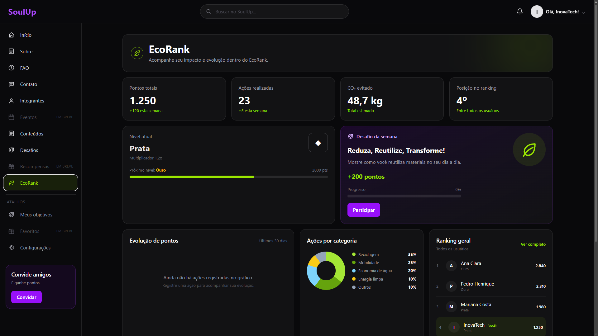
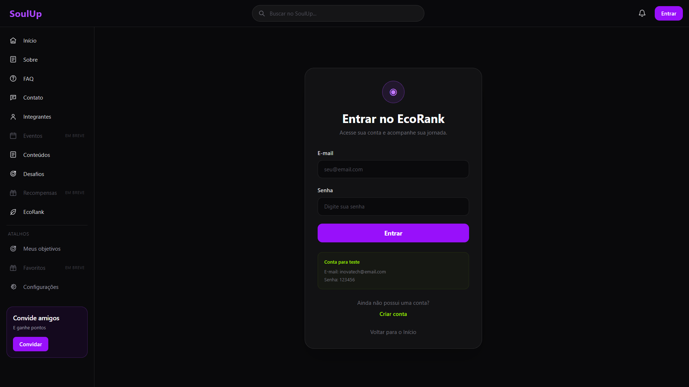
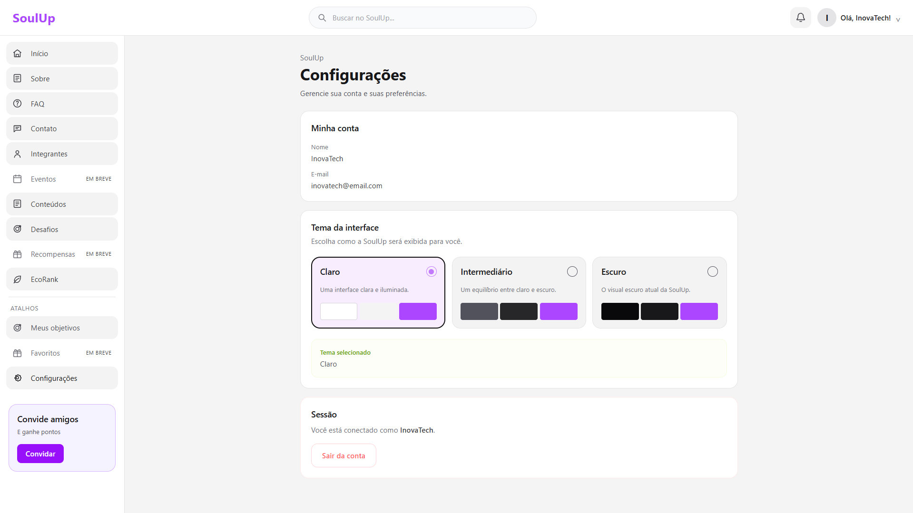
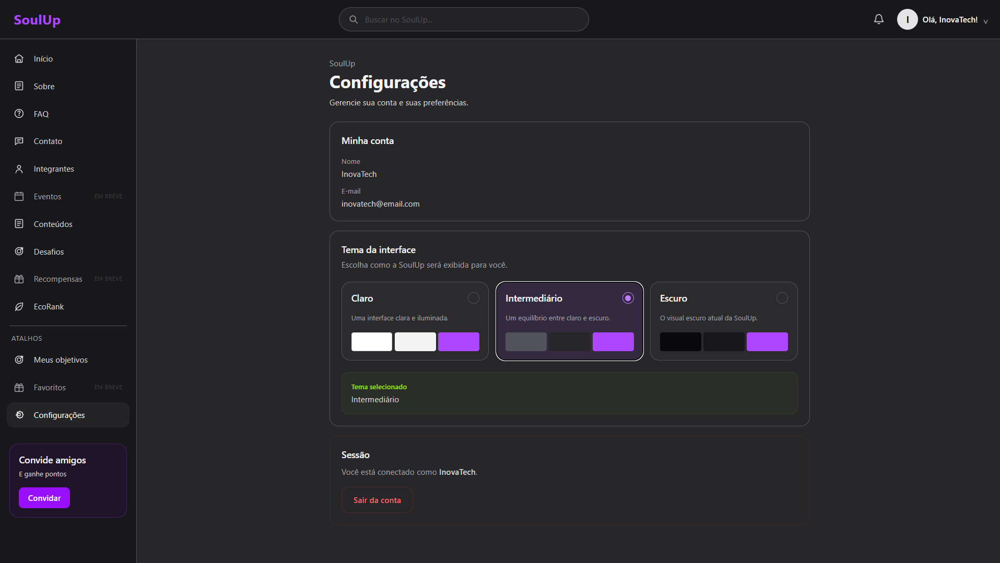
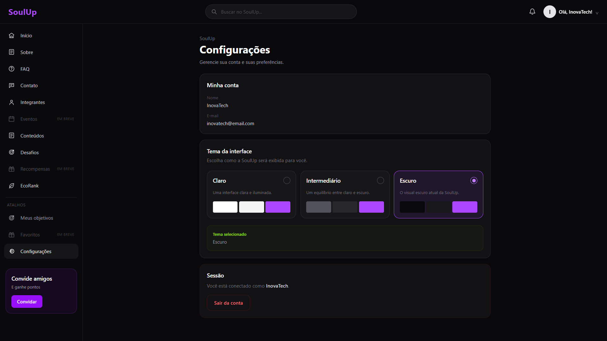
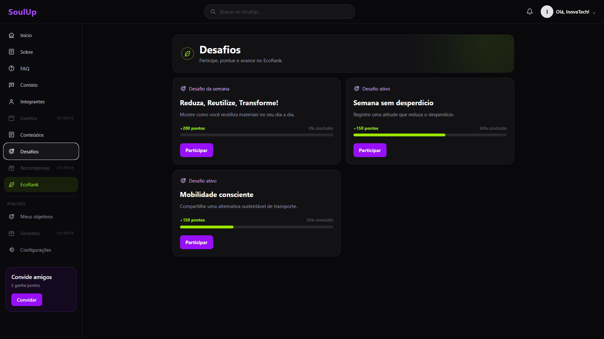
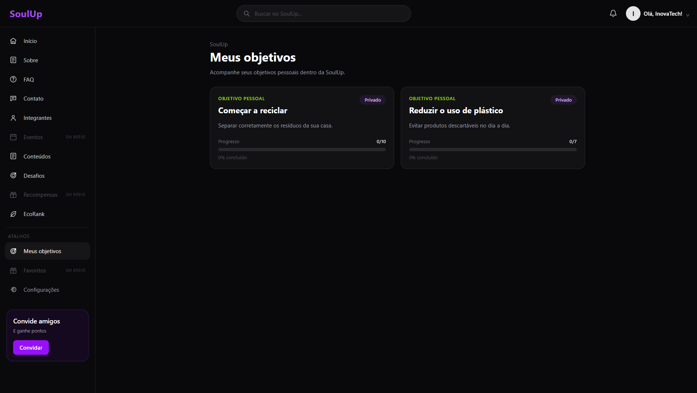
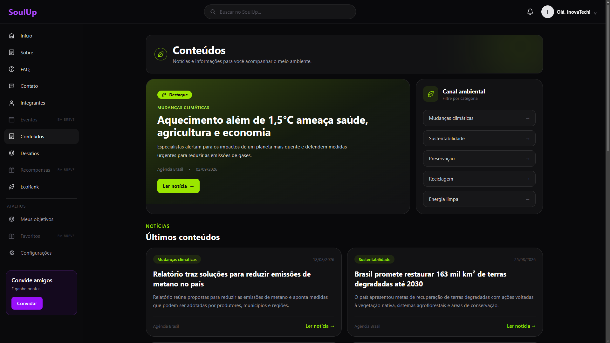
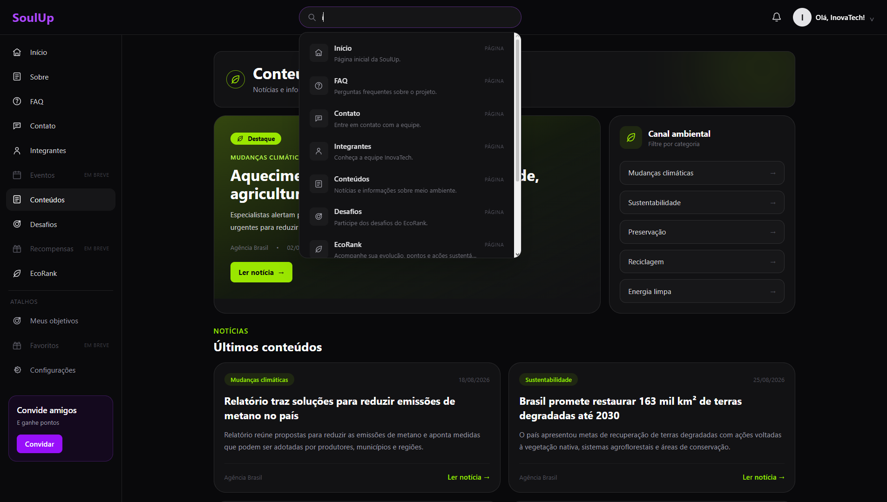
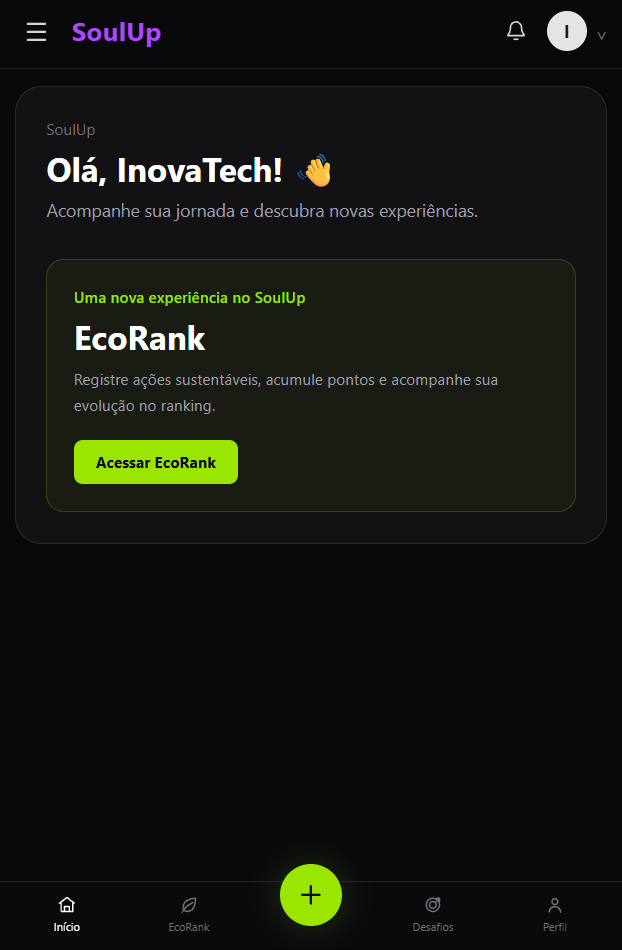

# Challenge - Front-end - FIAP

## Título e descrição do projeto 📌

Nome do Projeto: EcoRank + SoulUp

Objetivo do Projeto: Desenvolver o EcoRank como uma funcionalidade integrada à plataforma SoulUp, incentivando ações sustentáveis por meio de pontuação, validação das ações, evolução de níveis e ranking entre usuários.

# OBSERVAÇÃO!!

As imagens que estão FORA da pasta PUBLIC\IMAGES são as imagens que adicionamos NESTE ARQUIVO README.md, portanto elas não fazem parte do site/projeto e por isso estão fora da pasta.

## Tecnologias Utilizadas 💻

    1 - React

    2 - Vite

    3 - TypeScript

    4 - Tailwind CSS

    5 - React Router DOM

    6 - React Hook Form

## Estrutura de Pastas do Projeto 📂

📁 EcoRank-SoulUp-React-Vite-TS-ADAPTADO-COMPLETO

│

├📄 index.html → Arquivo principal de entrada da aplicação

├📄 package.json → Dependências, scripts e configurações do projeto

├📄 package-lock.json → Controle das versões das dependências instaladas

├📄 postcss.config.js → Configuração do PostCSS utilizado pelo Tailwind CSS

├📄 vite.config.ts → Configuração do Vite

├📄 tsconfig.json → Configuração principal do TypeScript

├📄 tsconfig.app.json → Configurações do TypeScript para a aplicação

├📄 tsconfig.node.json → Configurações do TypeScript para arquivos executados no Node.js

├📄 .gitignore → Arquivos e pastas ignorados pelo Git

├📄 README.md → Documentação do projeto

│

├── 📁 public/

│   └── 📁 images/

│       ├📄 guilherme.jpeg → Foto do integrante Guilherme Joel de Camargo

│       ├📄 pedro-felipe.jpeg → Foto do integrante Pedro Felipe de Castro Rosa

│       ├📄 pedro-henrique.jpeg → Foto do integrante Pedro Henrique Cavalcante De Souza

│       ├📄 rafaela.jpeg → Foto da integrante Rafaela Donadio Figueiredo Tavares

│       ├📄 victor.jpeg → Foto do integrante Victor Ferreira Gomes

│       ├📄 imagem-de-contato.png → Imagem utilizada na página de contato

│       ├📄 ranque-do-projeto.png → Representação visual da evolução dos ranques do EcoRank

│       └📄 tecnologias-utilizadas.png → Representação das tecnologias utilizadas no projeto

│

├── 📁 src/

│   │

│   ├📄 App.tsx → Configuração das rotas e páginas da aplicação

│   ├📄 main.tsx → Ponto de entrada da aplicação React

│   ├📄 index.css → Importação e configuração base do Tailwind CSS

│   │

│   ├── 📁 components/

│   │   ├📄 AccountMenu.tsx → Menu da conta do usuário

│   │   ├📄 BottomNav.tsx → Barra de navegação inferior para dispositivos móveis

│   │   ├📄 CategoryChart.tsx → Gráfico de ações sustentáveis por categoria

│   │   ├📄 ChallengeCard.tsx → Card de desafios sustentáveis

│   │   ├📄 EcoRankHeader.tsx → Cabeçalho das páginas do EcoRank

│   │   ├📄 Header.tsx → Cabeçalho principal da plataforma

│   │   ├📄 Icons.tsx → Componentes e ícones utilizados na aplicação

│   │   ├📄 ImpactChart.tsx → Gráfico de evolução do impacto e pontuação

│   │   ├📄 Layout.tsx → Estrutura principal de layout da aplicação

│   │   ├📄 LevelCard.tsx → Card de nível/ranque do usuário

│   │   ├📄 QuickActions.tsx → Cards de ações rápidas

│   │   ├📄 RankingCard.tsx → Card de ranking dos usuários

│   │   ├📄 Sidebar.tsx → Menu lateral de navegação

│   │   └📄 StatCard.tsx → Cards de indicadores e estatísticas

│   │

│   ├── 📁 context/

│   │   ├📄 AuthContext.tsx → Gerenciamento de autenticação e dados dos usuários

│   │   └📄 ThemeContext.tsx → Gerenciamento dos temas da aplicação

│   │

│   ├── 📁 data/

│   │   └📄 mock.ts → Dados utilizados para demonstração do protótipo

│   │

│   └── 📁 pages/

│       ├📄 Cadastro.tsx → Página de cadastro de usuários

│       ├📄 Challenges.tsx → Página de desafios sustentáveis

│       ├📄 Configuracoes.tsx → Página de configurações

│       ├📄 Contato.tsx → Página de contato

│       ├📄 Conteudos.tsx → Página de conteúdos e artigos

│       ├📄 EcoRankDashboard.tsx → Dashboard principal do EcoRank

│       ├📄 FAQ.tsx → Página de perguntas frequentes

│       ├📄 Home.tsx → Página inicial da plataforma

│       ├📄 Impact.tsx → Página de acompanhamento do impacto sustentável

│       ├📄 Integrantes.tsx → Página com os integrantes da equipe

│       ├📄 Login.tsx → Página de login

│       ├📄 MeusObjetivos.tsx → Página de objetivos sustentáveis do usuário

│       ├📄 Perfil.tsx → Página de perfil do usuário

│       ├📄 Ranking.tsx → Página de ranking dos usuários

│       ├📄 Sobre.tsx → Página com informações sobre o projeto

│       └📄 SubmitAction.tsx → Página para envio e registro de ações sustentáveis

└📄 README.md → Documentação do projeto

## Autores e créditos 👥
    1 - Guilherme Joel de Camargo - RM570403 - 1TDSPK
    Github: https://github.com/guilhermejcam
    Linkedln: https://www.linkedin.com/in/guilherme-camargo-a06410410/

    2 - Pedro Felipe de Castro Rosa - RM569049 - 1TDSPK
    Github: https://github.com/Pedrin740
    Linkedln: https://www.linkedin.com/in/pedro-felipe-castro-rosa/

    3 - Pedro Henrique Cardoso Cavalcante De Souza - RM570464 - 1TDSPK
    Github: https://github.com/pedrostack-01
    Linkedln: https://www.linkedin.com/in/pedro-souza-6282333b3/

    4 - Rafaela Donadio Figueiredo Tavares - RM572797 - 1TDSPK
    Github: https://github.com/mrafahdft
    Linkedln: https://www.linkedin.com/in/rafaela-donadio-bb3740369/

    5 - Victor Ferreira Gomes - RM569273 - 1TDSPK
    Github: https://github.com/Victor180422
    Linkedln: https://www.linkedin.com/in/victor-ferreira-gomes-63b2463b5/

## Imagens e representação do projeto

A imagem abaixo, mostra onde o usuário pode acessar o EcoRank e tudo que ele pode ter de informações sobre suas ações sustenáveis, colocação no ranking. Além disso, o usuário pode fazer o envio do registro de sua ação sustentável, descendo no site e selecionando a opção.

A imagem abaixo, mostra que o site possui um sistema de login (Atualmente, é apenas uma demonstração e não contém back-end) em que ele pode criar uma conta, logar nela ou logar em uma conta que deixamos para teste!

Após fazer login, o usuário também pode optar por escolher o tema do site (Claro, intermediário ou escuro) de acordo com sua preferência!
  

Também adicionamos alguns desafios já pré-defenidos em nossa solução e desafios privados do usuário (Recomendação que recebemos durante a mentoria da SoulUp)
 

Nesse projeto, resolvemos criar uma aba de conteúdos/notícias do meio-ambiente que possam inspirar os usuários a praticarem alguma ação sustentável

Além de tudo isso, agora nosso site também conta com uma barra de busca/pesquisa para o usuário localizar o que deseja com mais facilidade!

Utilizando a responsividade, também desenvolvemos uma interface diferenciada (Estilo aplicativo em nosso projeto)

## Link do Repositório 🔗
https://github.com/Pedrin740/Challenge---FIAP---2-Semestre.git

## Contato ✉️
E-mail dos integrantes:
    1 - RM570403@fiap.com.br - Guilherme Joel de Camargo
    2 - RM569049@fiap.com.br - Pedro Felipe de Castro Rosa
    3 - RM570464@fiap.com.br - Pedro Henrique Cardoso Cavalcante De Souza
    4 - RM572797@fiap.com.br - Rafaela Donadio Figueiredo Tavares
    5 - RM569273@fiap.com.br - Victor Ferreira Gomes